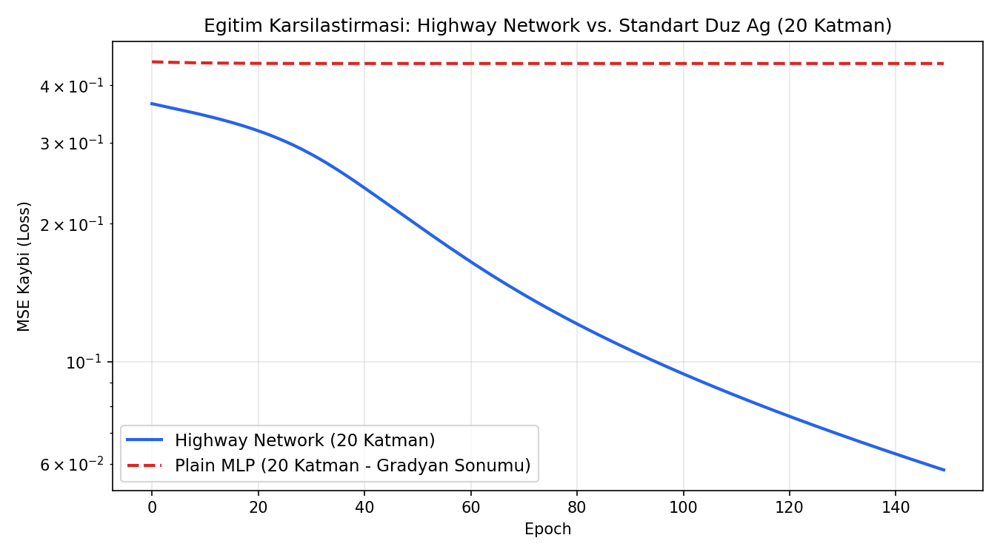

# Highway Networks (PyTorch)

Bu depo, **Rupesh Kumar Srivastava, Klaus Greff ve Jürgen Schmidhuber** tarafından önerilen ve derin öğrenmede yüzlerce katmanlı ağların eğitilmesine öncülük eden **"Highway Networks"** mimarisinin PyTorch uygulamasını içermektedir.

> **Referans Makaleler:**
> - [Highway Networks (arXiv:1505.00387, 2015)](https://arxiv.org/abs/1505.00387)
> - [Training Very Deep Networks (NeurIPS 2015 / arXiv:1507.06228)](https://arxiv.org/abs/1507.06228)

---

## 🧠 Model Mimarisi ve Matematiksel Temel

Klasik derin ileri beslemeli (feedforward) ağlarda, katman sayısı arttıkça gradyan kaybolması (vanishing gradient) nedeniyle optimizasyon tıkanır. Highway Networks, LSTM'lerdeki adaptif kapı (gate) mekanizmasını feedforward katmanlara uyarlayarak gradyanların onlarca/yüzlerce katman boyunca engelsiz akmasını (**information highways**) sağlar.

### Matematiksel Formülasyon

Standart bir katman $y = H(x, W_H)$ dönüşümü yaparken, Highway katmanı iki ayrı kapı tanımlar:
- **Dönüşüm Kapısı (Transform Gate):** $T(x) = \sigma(W_T x + b_T)$
- **Taşıma Kapısı (Carry Gate):** $C(x) = 1 - T(x)$

Katman çıktısı bu iki mekanizmanın adaptif birleşimidir:

$$y = H(x, W_H) \odot T(x, W_T) + x \odot (1 - T(x, W_T))$$

Burada:
- $\odot$ eleman bazlı çarpımı (Hadamard product) ifade eder.
- $\sigma$ sigmoid aktivasyon fonksiyonudur ($T(x) \in [0, 1]$).
- $T(x) \to 1$ olduğunda katman klasik dönüşüm $H(x)$ gibi davranır.
- $T(x) \to 0$ olduğunda katman kimlik (identity) $y = x$ moduna geçer ve gradyanlar doğrudan geriye akar.

### 💡 Kritik Püf Noktası: Negatif Bias Başlatması ($b_T < 0$)
Makalede önerildiği üzere dönüşüm kapısı bias'ı $b_T$ başlangıçta negatif bir değere (örn. $-2.0$) çekilir. Bu sayede eğitim başlangıcında $T(x) \approx 0$ olur ve ağ varsayılan olarak bilgiyi taşır (carry mode). Eğitim ilerledikçe ağ hangi katmanlarda dönüşüm yapacağını kendisi öğrenir.

> **Tarihsel Önemi:** Highway Networks, daha sonra geliştirilen **ResNet** (Residual Networks) mimarisinin en önemli doğrudan öncüsüdür ($T(x)=1$ ve $C(x)=1$ sabitlendiğinde rezidüel bağlantı elde edilir).

---

## 📊 20 Katmanlı Karşılaştırma Deneyi (Highway vs. Plain MLP)

Ağların derinlik arttıkça gradyan sönümüne direncini göstermek için 20 katmanlı bir **Highway Network** ile 20 katmanlı standart **Plain MLP** aynı sentetik görevde karşılaştırılmıştır:

| Adım (Epoch) | Highway Network Kaybı (MSE) | Standart Düz Ağ (Plain MLP) | Durum |
|:---:|:---:|:---:|:---|
| **Epoch 1** | 0.36486 | 0.45009 | Başlangıç |
| **Epoch 50** | 0.20196 | 0.44642 | Plain ağ gradyan sönümü nedeniyle tıkandı |
| **Epoch 100** | 0.09524 | 0.44642 | Highway stabil öğrenmeye devam ediyor |
| **Epoch 150** | **0.05817** | **0.44642** | Highway başarıyla yakınsadı |



---

## 🚀 Kurulum ve Çalıştırma

### Gereksinimler

```bash
pip install -r requirements.txt
```

*(veya doğrudan: `pip install torch matplotlib`)*

### Modeli ve Deneyi Çalıştırma

```bash
python main.py
```

Kod çalıştığında:
1. 3 katmanlı temel Highway modelinin girdi/çıktı tensör boyutlarını test eder.
2. 20 katmanlı Highway Network ile Plain MLP'yi eğitir ve sonuçları ekrana basar.
3. Kayıp eğrilerini `highway_vs_plain.png` olarak kaydeder.

---

## 💻 Örnek Kod Kullanımı

```python
import torch
from main import HighwayNetwork

# 128 boyutlu, 10 katmanlı Highway Network
model = HighwayNetwork(size=128, num_layers=10, gate_bias=-2.0)

x = torch.randn(32, 128)  # Batch: 32, Özellik: 128
y = model(x)

print("Çıktı boyutu:", y.shape)  # torch.Size([32, 128])
```

---

## 📚 Kaynakça

```bibtex
@article{srivastava2015highway,
  title={Highway Networks},
  author={Srivastava, Rupesh Kumar and Greff, Klaus and Schmidhuber, J{\"u}rgen},
  journal={arXiv preprint arXiv:1505.00387},
  year={2015}
}

@inproceedings{srivastava2015training,
  title={Training Very Deep Networks},
  author={Srivastava, Rupesh Kumar and Greff, Klaus and Schmidhuber, J{\"u}rgen},
  booktitle={Advances in Neural Information Processing Systems (NeurIPS)},
  year={2015}
}
```
